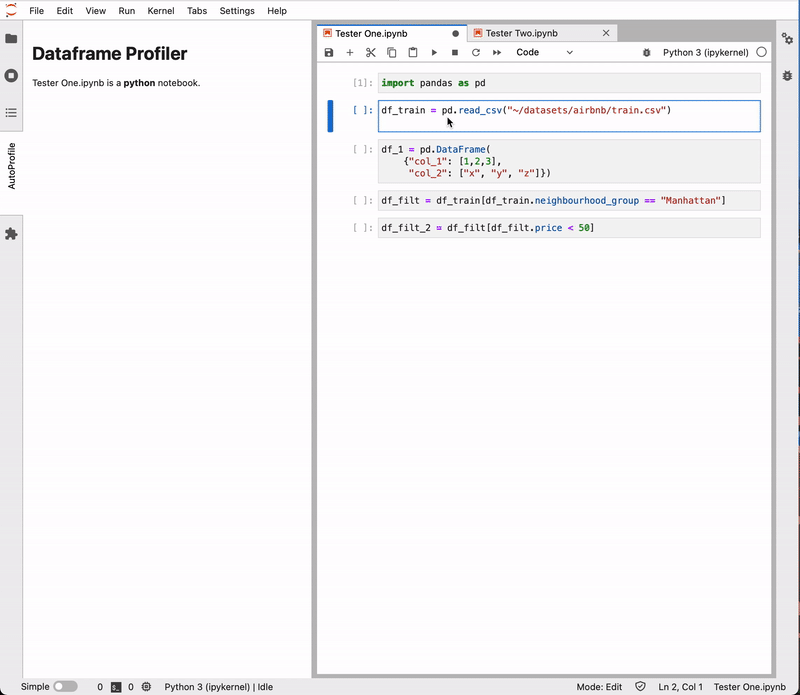

# AutoProfile

Profile your Pandas Dataframes! Autoprofile will automatically visualize your Pandas dataframes after every execution, no extra code necessary.

There's more bugs than features right now so buyer beware!


<!-- ## Short Demo

Autoprofile reads your current Jupyter notebook and produces profiles for the Pandas Dataframes in your memory along with some summary statistics and a data preview.

 -->

## Requirements

-   JupyterLab >= 3.0
-   Pandas

## Install

```bash
pip install digautoprofile
```

For development install instructions, see [CONTRIBUTING.md](CONTRIBUTING.md).

If you're having install issues, see [TROUBLESHOOTING.md](TROUBLESHOOTING.md).

## Acknowledgements

Big thanks to the Rill Data team! Much of our profiler UI code is from [Rill Developer](https://github.com/rilldata/rill-developer).
